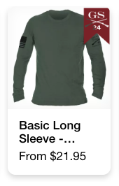
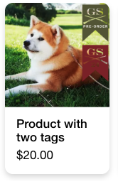
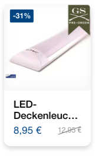
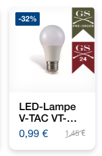
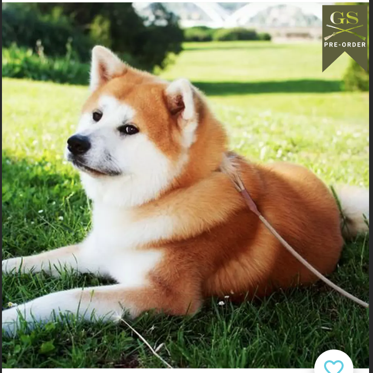

# Demo

## One badge with trigger tags

```json
{
  "badgeMap": [
    {
      "triggerTags": [
        "preorder"
      ],
      "triggerProps": [],
      "src": "http://data.shopgate.com/shop_widget_images/25579/cc257d580e2d65f88db9ed490fc512ac.min.png"
    },
    {
      "triggerTags": [
        "gs24"
      ],
      "triggerProps": [],
      "src": "http://data.shopgate.com/shop_widget_images/25579/13c29bdf6bc108777a5062fc774d6bdf.min.png"
    }
  ],
  "badgeDisplayCount": 1,
  "badgeWidth": "25"
}
```

## Two badges with trigger tags

```json
{
  "badgeMap": [
    {
      "triggerTags": [
        "preorder"
      ],
      "triggerProps": [],
      "src": "http://data.shopgate.com/shop_widget_images/25579/cc257d580e2d65f88db9ed490fc512ac.min.png"
    },
    {
      "triggerTags": [
        "gs24"
      ],
      "triggerProps": [],
      "src": "http://data.shopgate.com/shop_widget_images/25579/13c29bdf6bc108777a5062fc774d6bdf.min.png"
    }
  ],
  "badgeDisplayCount": 2,
  "badgeWidth": "25"
}
```

## One badge with trigger properites


**Config**
```json
{
  "badgeMap": [
    {
      "triggerTags": [],
      "triggerProps": [
        {
          "label": "Energieeffizienzklasse",
          "value": "A+"
        }
      ],
      "src": "http://data.shopgate.com/shop_widget_images/25579/cc257d580e2d65f88db9ed490fc512ac.min.png"
    },
    {
      "triggerTags": [],
      "triggerProps": [
        {
          "label": "Energieeffizienzklasse",
          "value": "A+"
        }
      ],
      "src": "http://data.shopgate.com/shop_widget_images/25579/13c29bdf6bc108777a5062fc774d6bdf.min.png"
    }
  ],
  "badgeDisplayCount": 1,
  "badgeWidth": "25"
}
 ```

## Two badges with trigger properites


**Config**
```json
{
  "badgeMap": [
    {
      "triggerTags": [],
      "triggerProps": [
        {
          "label": "Energieeffizienzklasse",
          "value": "A+"
        }
      ],
      "src": "http://data.shopgate.com/shop_widget_images/25579/cc257d580e2d65f88db9ed490fc512ac.min.png"
    },
    {
      "triggerTags": [],
      "triggerProps": [
        {
          "label": "Energieeffizienzklasse",
          "value": "A+"
        }
      ],
      "src": "http://data.shopgate.com/shop_widget_images/25579/13c29bdf6bc108777a5062fc774d6bdf.min.png"
    }
  ],
  "badgeDisplayCount": 2,
  "badgeWidth": "25"
}
 ```

 ## maxWidth Configuration
 

 **Config**
```json
{
  "badgeMap": [
    {
      "triggerTags": [
        "preorder"
      ],
      "triggerProps": [],
      "src": "http://data.shopgate.com/shop_widget_images/25579/cc257d580e2d65f88db9ed490fc512ac.min.png"
    },
    {
      "triggerTags": [
        "gs24"
      ],
      "triggerProps": [],
      "src": "http://data.shopgate.com/shop_widget_images/25579/13c29bdf6bc108777a5062fc774d6bdf.min.png"
    }
  ],
  "badgeDisplayCount": 1,
  "badgeWidth": "25",
  "maxBadgeWidth": null
}
 ```

  

 **Config**
```json
{
  "badgeMap": [
    {
      "triggerTags": [
        "preorder"
      ],
      "triggerProps": [],
      "src": "http://data.shopgate.com/shop_widget_images/25579/cc257d580e2d65f88db9ed490fc512ac.min.png"
    },
    {
      "triggerTags": [
        "gs24"
      ],
      "triggerProps": [],
      "src": "http://data.shopgate.com/shop_widget_images/25579/13c29bdf6bc108777a5062fc774d6bdf.min.png"
    }
  ],
  "badgeDisplayCount": 1,
  "badgeWidth": "25",
  "maxBadgeWidth": "200"
}
 ```